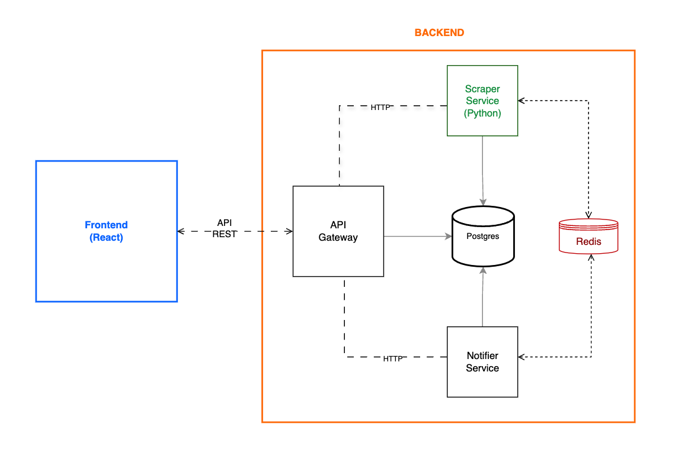

# Prueba Técnica: Procesamiento de Links con Microservicios





[Diagrama DrawIO](https://drive.google.com/file/d/1OH4BbUD51FvBNRRwW43PnECcjYcyTZoz/view?usp=sharing)

## Descripción

Se te ha dado la tarea de scrapear las notas de prensa de la página <https://www.comunidadandina.org/notas-de-prensa/>

El objetivo de esta tarea es implementar un sistema basado en microservicios para procesar un archivo .txt que contiene varios links de noticias. El sistema debe realizar las siguientes funciones:

1. **Subida de Archivos**: Una vez cargado el archivo, los links extraídos son procesados de manera asíncrona mediante un sistema de colas. Este enfoque distribuye las tareas en segundo plano para evitar la sobrecarga del servidor. Los archivos de prueba estan ubicados en la carpeta [/files](files)
2. **Scrapeo de Links**: Despues de cargar el archivo, procesar los links del archivo utilizando colas para evitar bloquear el frontend.
3. **Almacenamiento**: Guardar el contenido scrapeado de cada link en una base de datos (Postgres, MySQL, MSSQL).
4. **Notificaciones**: Notificar al usuario por correo electrónico una vez finalizado el procesamiento.
5. **Frontend**: Proveer una interfaz de usuario desarrollada con **React** o **Next.js** (usando TypeScript).
6. **Backend**: Utilizar arquitectura de microservicios, cada servicio debe utilizar una tecnología diferente, incluyendo **.NET Core**, **Python** y **Node**.
7. **Despliegue**: Toda la solución debe ser desplegable mediante Docker, con un único archivo `docker-compose.yml`.

## Requisitos Técnicos

1. **Frontend**: 
   - La plantilla incluida esta implementada con **React**, pero se puede utilizar como alternativa **Angular** si asi lo prefieren (es valido utilizar plantillas ya diseñadas).
   - Desarrollado con **React** o **Next.js**.
   - Mostrar un listado de los archivos subidos con su estado de procesamiento, fecha de subida y cantidad de links procesados por archivo.
   - Mostrar un listado de los links scrapeados por archivo, incluyendo el contenido extraído.
   - BONUS ADICIONAL:
      - Permitir a los usuarios registrarse e iniciar sesión.
      - Listar archivos subidos por el usuario logueado.

2. **Backend**: Arquitectura de **microservicios**:
   - **Hub API**:
     - Funciona como único punto de entrada para el frontend y se comunica con los demas microservicios.
     - Implementado en **.NET Core**.
     - BONUS ADICIONAL:
       - Implementar autenticación via JWT.
   - **Servicio de Scrapeo**:
     - Procesa los links de los archivos subidos utilizando colas para evitar bloquear el sistema.
     - Implementado con **Python (FastAPI)**.
     - Utilizar Redis, Celery para las colas.
   - **Servicio de Notificaciones**:
     - Envía un correo electrónico al usuario notificando la finalización del procesamiento.
     - Implementado con **(Python o .NET Core)**.

3. **Infraestructura**:
   - **Docker**: Toda la solución debe ser levantada con Docker utilizando un único archivo `docker-compose.yml`.
   - **Base de datos**: Utilizar **PostgreSQL** para almacenar los datos.

---

## Arquitectura del Proyecto

La arquitectura de carpetas recomendada del proyecto.

```plaintext
solution
├── hub/                        # Servicio Hub (API Gateway con .NET Core)
│   ├── Controllers/            # Controladores
│   ├── Models/                 # Modelos
│   └── Program.cs              # Configuración principal
│   └── Dockerfile              # Configuración docker del servicio.
├── notifier/                   # Servicio de Notificaciones (Python o .NET Core)
│   ├── src/                    # Código fuente
│   ├── package.json            # Dependencias
│   └── emailSender.js          # Lógica de envío de correos
│   └── Dockerfile              # Configuración docker del servicio.
├── react/                      # Frontend (React o Next.js) typescript.
│   ├── src/                    # Código fuente
│   ├── public/                 # Archivos estáticos
│   └── package.json            # Dependencias
├── scraper/                    # Servicio de Scrapeo (FastAPI)
│   ├── apps/                   # Lógica del scrapeo
│   ├── models.py               # Modelos de la base de datos
│   ├── tasks.py                # Lógica de colas
│   └── settings.py             # Configuración
│   └── Dockerfile              # Configuración docker del servicio.
├── docker-compose.yml          # Orquestación de contenedores
├── .env                        # Variables de entorno
└── README.md                   # Este archivo
```

## Puertos
```
| Servicio  | Puerto |
|-----------|--------|
| frontend  | 9999   |
| hub       | 9010   |
| scraper   | 9020   |
| notifier  | 9030   |
| postgres  | 9040   |
| redis     | 9050   |
```
